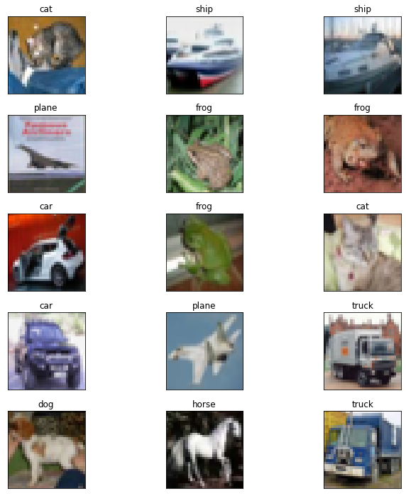
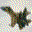
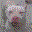
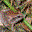
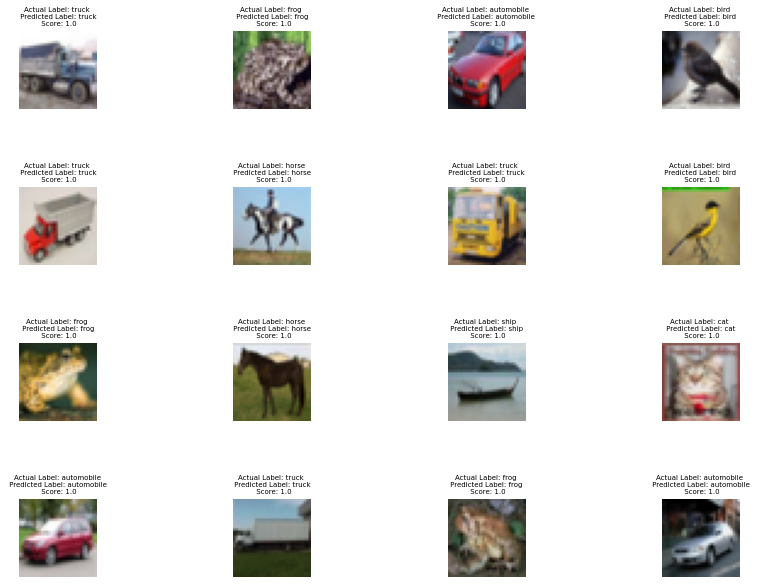
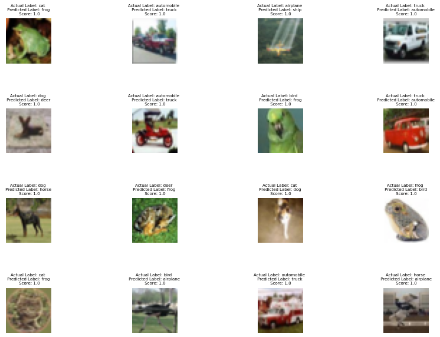
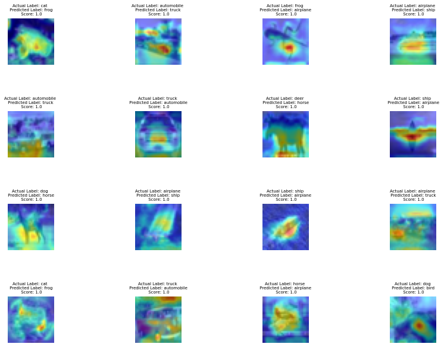

# CIFAR-10 Image Classification

## Objective

The objective of this project is to develop a neural network model that accurately classifies images from the CIFAR-10 dataset. By leveraging computer vision, our aim is to create a robust model capable of automatic recognition and categorization of these images. The CIFAR-10 dataset presents a more challenging task compared to MNIST, as it contains color images with higher complexity and variability.

## Dataset Description

The CIFAR-10 dataset is a well-known benchmark extensively used for image classification tasks. It consists of 50,000 training images and 10,000 testing images, each representing a colored image with dimensions of 32x32 pixels. The dataset is divided into ten classes, namely `'plane', 'car', 'bird', 'cat', 'deer', 'dog', 'frog', 'horse', 'ship', and 'truck'`, with each class containing 5,000 images.



## Directory Structure

The repository follows a specific directory structure:

### src/models/resnet.py

The `model.py` file contains the implementation of the neural network model architecture. The current architecture has been chosen to align with the project objectives. Here is the model architecture:

```
----------------------------------------------------------------
        Layer (type)               Output Shape         Param #
================================================================
            Conv2d-1           [-1, 64, 32, 32]           1,728
       BatchNorm2d-2           [-1, 64, 32, 32]             128
              ReLU-3           [-1, 64, 32, 32]               0
           Dropout-4           [-1, 64, 32, 32]               0
            Conv2d-5           [-1, 64, 32, 32]          36,864
       BatchNorm2d-6           [-1, 64, 32, 32]             128
              ReLU-7           [-1, 64, 32, 32]               0
           Dropout-8           [-1, 64, 32, 32]               0
            Conv2d-9           [-1, 64, 32, 32]          36,864
      BatchNorm2d-10           [-1, 64, 32, 32]             128
       BasicBlock-11           [-1, 64, 32, 32]               0
           Conv2d-12           [-1, 64, 32, 32]          36,864
      BatchNorm2d-13           [-1, 64, 32, 32]             128
             ReLU-14           [-1, 64, 32, 32]               0
          Dropout-15           [-1, 64, 32, 32]               0
           Conv2d-16           [-1, 64, 32, 32]          36,864
      BatchNorm2d-17           [-1, 64, 32, 32]             128
       BasicBlock-18           [-1, 64, 32, 32]               0
           Conv2d-19          [-1, 128, 16, 16]          73,728
      BatchNorm2d-20          [-1, 128, 16, 16]             256
             ReLU-21          [-1, 128, 16, 16]               0
          Dropout-22          [-1, 128, 16, 16]               0
           Conv2d-23          [-1, 128, 16, 16]         147,456
      BatchNorm2d-24          [-1, 128, 16, 16]             256
           Conv2d-25          [-1, 128, 16, 16]           8,192
      BatchNorm2d-26          [-1, 128, 16, 16]             256
       BasicBlock-27          [-1, 128, 16, 16]               0
           Conv2d-28          [-1, 128, 16, 16]         147,456
      BatchNorm2d-29          [-1, 128, 16, 16]             256
             ReLU-30          [-1, 128, 16, 16]               0
          Dropout-31          [-1, 128, 16, 16]               0
           Conv2d-32          [-1, 128, 16, 16]         147,456
      BatchNorm2d-33          [-1, 128, 16, 16]             256
       BasicBlock-34          [-1, 128, 16, 16]               0
           Conv2d-35            [-1, 256, 8, 8]         294,912
      BatchNorm2d-36            [-1, 256, 8, 8]             512
             ReLU-37            [-1, 256, 8, 8]               0
          Dropout-38            [-1, 256, 8, 8]               0
           Conv2d-39            [-1, 256, 8, 8]         589,824
      BatchNorm2d-40            [-1, 256, 8, 8]             512
           Conv2d-41            [-1, 256, 8, 8]          32,768
      BatchNorm2d-42            [-1, 256, 8, 8]             512
       BasicBlock-43            [-1, 256, 8, 8]               0
           Conv2d-44            [-1, 256, 8, 8]         589,824
      BatchNorm2d-45            [-1, 256, 8, 8]             512
             ReLU-46            [-1, 256, 8, 8]               0
          Dropout-47            [-1, 256, 8, 8]               0
           Conv2d-48            [-1, 256, 8, 8]         589,824
      BatchNorm2d-49            [-1, 256, 8, 8]             512
       BasicBlock-50            [-1, 256, 8, 8]               0
           Conv2d-51            [-1, 512, 4, 4]       1,179,648
      BatchNorm2d-52            [-1, 512, 4, 4]           1,024
             ReLU-53            [-1, 512, 4, 4]               0
          Dropout-54            [-1, 512, 4, 4]               0
           Conv2d-55            [-1, 512, 4, 4]       2,359,296
      BatchNorm2d-56            [-1, 512, 4, 4]           1,024
           Conv2d-57            [-1, 512, 4, 4]         131,072
      BatchNorm2d-58            [-1, 512, 4, 4]           1,024
       BasicBlock-59            [-1, 512, 4, 4]               0
           Conv2d-60            [-1, 512, 4, 4]       2,359,296
      BatchNorm2d-61            [-1, 512, 4, 4]           1,024
             ReLU-62            [-1, 512, 4, 4]               0
          Dropout-63            [-1, 512, 4, 4]               0
           Conv2d-64            [-1, 512, 4, 4]       2,359,296
      BatchNorm2d-65            [-1, 512, 4, 4]           1,024
       BasicBlock-66            [-1, 512, 4, 4]               0
           Conv2d-67             [-1, 10, 4, 4]           5,130
        AvgPool2d-68             [-1, 10, 1, 1]               0
          Flatten-69                   [-1, 10]               0
================================================================
Total params: 11,173,962
Trainable params: 11,173,962
Non-trainable params: 0
----------------------------------------------------------------
Input size (MB): 0.01
Forward/backward pass size (MB): 16.00
Params size (MB): 42.63
Estimated Total Size (MB): 58.64
----------------------------------------------------------------
```

### src/utils.py

The `utils.py` file includes helper functions for various tasks such as obtaining the device, training and testing the model, plotting training metrics, and visualizing correct and incorrect predictions made by the model.

### examples/cifar10/cifar.ipynb

The main file for this project is the Jupyter Notebook file, `cifar.ipynb`. It encompasses the training and evaluation of the model.

## Results
Class Activation Map through 25 Epochs: A Demonstration of How the Model Learns.

<!-- markdownlint-disable MD033 -->
<table>
  <tr>
    <td align="center">
      
      <br>Ship
    </td>
    <td align="center">
      
      <br>Airplane
    </td>
    <td align="center">
      
      <br>Bird
    </td>
    <td align="center">
      
      <br>Dog
    </td>
    <td align="center">
      
      <br>Frog
    </td>
  </tr>
</table>
<!-- markdownlint-enable MD033 -->


Our trained model has demonstrated exceptional performance, achieving high accuracy even on challenging images from the CIFAR-10 dataset. Here are some examples of correctly classified images:




However, it is important to note that there are instances where our model struggles to make accurate predictions. The following images present significant challenges for comprehension:




These instances serve as a reminder that even state-of-the-art models have limitations when confronted with highly ambiguous or complex images.

Please be aware that the images provided above are representative samples and may not reflect the overall accuracy of the model across the entire CIFAR-10 dataset.

For further details on the project and its implementation, refer to the accompanying code and documentation.

**Note:** The images used in the examples are for illustrative purposes and may not accurately reflect the actual performance of the model.