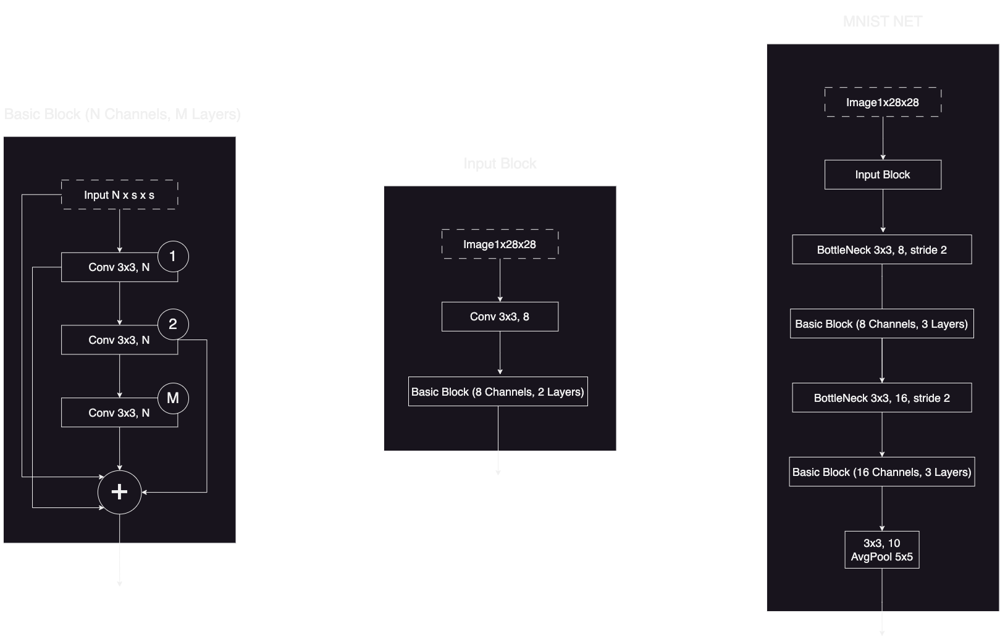
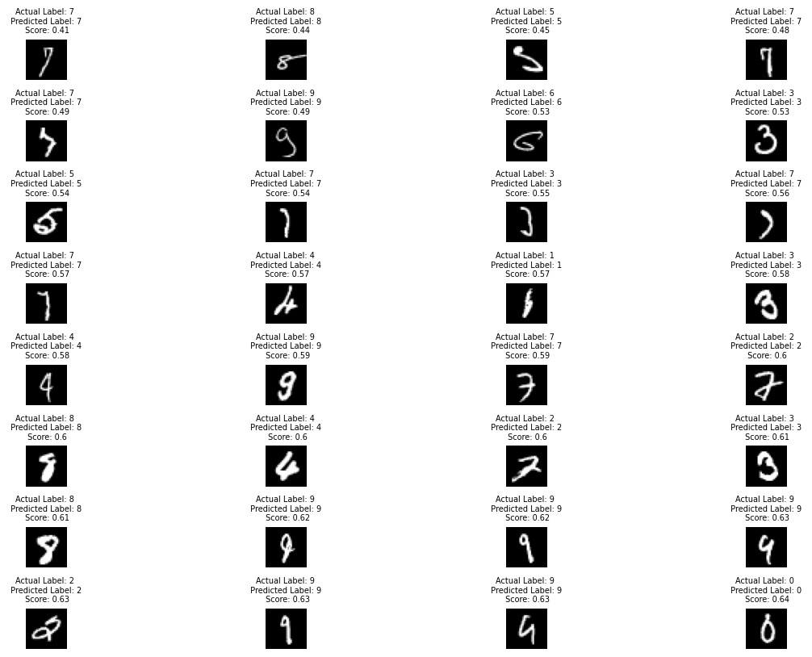
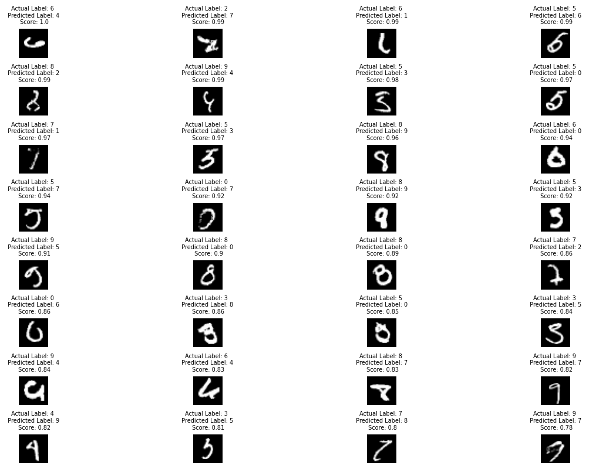

# MNIST Handwritten Digit Classification

## Objective

The objective of this project is to develop a neural network model that accurately classifies handwritten digits from the MNIST dataset. By leveraging machine learning techniques and computer vision, our aim is to create a robust model capable of automatic recognition and categorization of these digits. The MNIST dataset, despite its simplicity, serves as a fundamental introduction to computer vision.

## Dataset Description

The MNIST dataset is widely recognized and extensively used in machine learning, particularly for image classification tasks. It consists of 60,000 training images and 10,000 testing images, each representing a grayscale handwritten digit of size 28x28 pixels.

## Directory Structure

The repository follows a specific directory structure:

### src/model.py

Our model achieves an impressive accuracy of **99.61%** in just 20 Epochs, utilizing a mere **13,244 parameters**. However, by reducing the channel size to 8 in the second basic block, we can still attain a remarkable accuracy of **99.41%** within the same 20 Epochs, while significantly reducing the parameter count to just **6,716**.

The `model.py` file contains the implementation of the neural network model architecture. The current architecture has been chosen to support the objectives of the project. Here is the model architecture:

### src/utils.py

This `utils.py` includes helper functions for various tasks such as obtaining the device, training and testing the model, plotting training metrics, and visualizing correct and incorrect predictions made by the model.

### S5.ipynb

The main file for this project is the Jupyter Notebook file, `S5.ipynb`. It encompasses the training and evaluation of the model.

## Results

Our trained model has demonstrated exceptional performance, achieving high accuracy even on challenging images. Here are some examples of correctly classified images:

However, it is important to note that there are instances where our model struggles to make accurate predictions. The following images present significant challenges for comprehension:

These instances serve as a reminder that even state-of-the-art models have limitations when confronted with highly ambiguous or complex images.

Please be aware that the images provided above are representative samples and may not reflect the overall accuracy of the model across the entire MNIST dataset.

For further details on the project and its implementation, refer to the accompanying code and documentation.

**Note:** The images used in the examples are for illustrative purposes and may not accurately reflect the actual performance of the model.